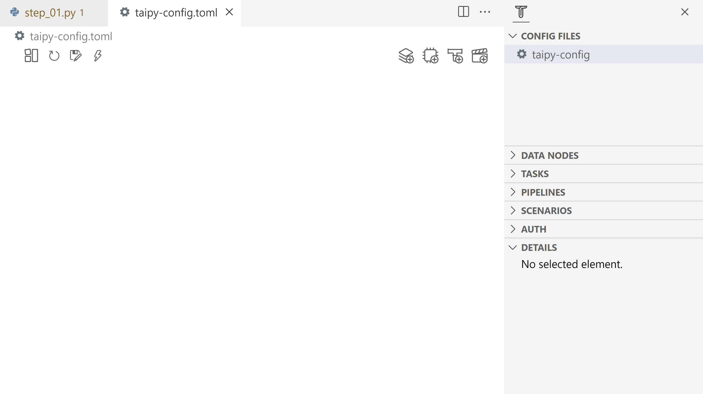

# Step 1: Configuration and execution

Before going directly into the code and examples, some concepts and terms must be defined. Taipy Core revolves around four major concepts.

## Four fundamental concepts in Taipy Core:
- Data Nodes: are the translation of variables in Taipy. Data Nodes don't contain the data but know how to retrieve it. They can refer to any data: any Python object (string, int, list, dict, model, dataframe, etc), a Pickle file, a CSV file, an SQL database, etc. They know how to read and write data. You can even write your own custom Data Node if needed to access a particular data format.

- Tasks: are the translation of functions in Taipy.

- Pipelines: are a list of tasks executed with intelligent scheduling created automatically by Taipy. They usually represent a sequence of Tasks/functions corresponding to different algorithms like a simple baseline Algorithm or a more sophisticated Machine-Learning pipeline.

- Scenarios: End-Users very often require modifying various parameters to reflect different business situations. Taipy Scenarios will provide the framework to "play"/"execute" pipelines under different conditions/variations (i.e., data/parameters modified by the end-user)


## What is a configuration?

Configuration is the structure of what is our scenario. It represents our Direct Acyclic Graph but also how we want our data to be stored or how our code is run. Taipy can create multiple instances of this structure with different data called scenarios. Thus, we need a way to define it through this configuration step.


Let's create our first configuration through Taipy Studio or direct Python Code and then create our entities to submit.

```python
from taipy import Config
import taipy as tp

# Normal function used by Taipy
def double(nb):
    return nb * 2
```

{ width=700 style="margin:auto;display:block;border: 4px solid rgb(210,210,210);border-radius:7px" }

- Two Data Nodes are being configured ('input' and 'output'). The 'input' Data Node has a _default_data_ put at 21. They will be stored as Pickle files by default and are unique to their scenario. To clarify, the names given to the Data Nodes are arbitrary. They could have been named something else like 'first_data' and 'last_data'; every appearance of these names should also be changed accordingly.

- The task links the two Data Nodes through the Python function _double_.

- The pipeline will contain this one task, and the scenario will include this one pipeline.

{ width=700 style="margin:auto;display:block;border: 4px solid rgb(210,210,210);border-radius:7px" }


=== "Taipy Studio/TOML configuration"

    **Note**: Remember to save the file after each change.
    - Create a new file: 'config_01.toml'
    - Open Taipy Studio view
    - Right-click on the right configuration and choose 'Taipy: Show View'
    - Add your first Data Node by clicking the button on the right corner of the window
    - Create a name for it and change its details in the 'Details' section of Taipy Studio
            - name: input
            - Details: default_data=21, storage_type=pickle
    - Do the same for the output
            - name: output
            - Details: storage_type=pickle
    - Add a task and choose a function to associate with `<module>.<name>:function`
            - name: double
            - Details: function=`__main__.double:function`
    - Link the Data Nodes and the task
    - Add a pipeline and link it to the task
    - Add a scenario and link to the pipeline

    ```python
    Config.load('config_01.toml')

    # my_scenario is the id of the scenario configured
    scenario_cfg = Config.scenarios['my_scenario']
    ```

=== "Python configuration"

    Here is the code to configure a simple scenario.

    ```python
    # Configuration of Data Nodes
    input_data_node_cfg = Config.configure_data_node("input", default_data=21)
    output_data_node_cfg = Config.configure_data_node("output")

    # Configuration of tasks
    task_cfg = Config.configure_task("double",
                                     double,
                                     input_data_node_cfg,
                                     output_data_node_cfg)

    # Configuration of the pipeline and scenario
    pipeline_cfg = Config.configure_pipeline("my_pipeline", [task_cfg])
    scenario_cfg = Config.configure_scenario("my_scenario", [pipeline_cfg])
    ```

The code below presents how you can create scenarios and submit them.

First of all, Taipy has to be run (`tp.Core().run()`). It will create a service that will act as a job scheduler.

Creating a scenario/pipeline (`tp.create_scenario(<Scenario Config>)`/`tp.create_pipeline(<Pipeline Config>)` will create all the related entities. These entities are being created thanks to the previous configuration, but no code is being run yet. `tp.submit(<Scenario>)` is the line of code that will run all the related pipelines and tasks. Note that a pipeline or a task can also be submitted (`tp.submit(<Pipeline>)`, `tp.submit(<Task>)`).

```python
# Run of the Core
tp.Core().run()

# Creation of the scenario and execution
scenario = tp.create_scenario(scenario_cfg)
tp.submit(scenario)

print("Value at the end of task", scenario.output.read())
```
Results:
```
    [2022-12-22 16:20:02,740][Taipy][INFO] job JOB_double_699613f8-7ff4-471b-b36c-d59fb6688905 is completed.
    Value at the end of task 42
```    

'/.data' is the default storage folder for Taipy Core. It contains data, scenarios, pipelines, jobs, and tasks. These entities are persisted between two runs depending on how the code is run.

## Ways of executing the code: Versioning

Taipy Core provides a versioning system to keep track of different Configurations (DAG, execution modes, ...). `python main.py -h` opens a helper to understand the versioning options. Here are the principal ways to run the code with versioning:

- _Development_: is the default way of executing the code. Data of a previous Development run is erased. `python main.py` will run it.

- _Experiment_: data are stored after each run, and an identifier is attached to each run. `python main.py --experiment` will execute the code in Experiment mode. The user can decide the identifier to run with the data of a previous run. The version number can be given: `python main.py --experiment 1`.

- _Production_: data are stored after each run. The user can decide the identifier to run with the data of a previous run. `python main.py --experiment` will execute the code in Experiment mode, or `python main.py --experiment 1` to run it with a specific version.
