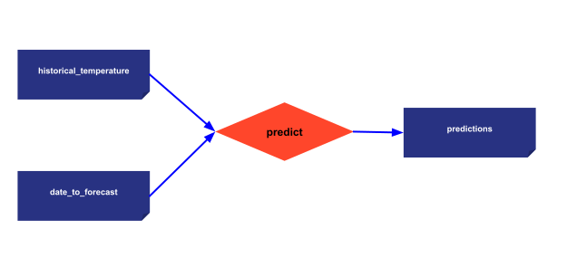

> You can download the code of this step [here](../src/step_01.py) or all the steps [here](https://github.com/Avaiga/taipy-getting-started-core/tree/develop/src).

# Configuration and execution

*Time to complete: 15 minutes; Level: Beginner*

Before looking at some code examples, let’s define some basic terms Taipy Core uses. Taipy Core revolves around three major concepts.

## Three fundamental concepts in Taipy Core:
- [**Data Node**](https://docs.taipy.io/en/latest/manuals/core/concepts/data-node/): is the translation of a _variable_ in Taipy. Data Nodes know how to retrieve any type of data. They can refer to: any Python object (string, int, list, dict, model, data frame, etc.), a Pickle file, a CSV file, a SQL database, etc.

- [**Task**](https://docs.taipy.io/en/latest/manuals/core/concepts/task/): is the expression of a _function_ in Taipy.

- [**Scenarios**](https://docs.taipy.io/en/latest/manuals/core/concepts/scenario/): is an instance of your pipelines. End-users often require modifying various parameters to reflect different business situations. Taipy Scenarios provide the framework to "run"/"execute" pipelines under different conditions/variations (i.e., data/parameters modified by the end-user).


## What is a configuration?

A [**configuration**](https://docs.taipy.io/en/latest/manuals/core/config/) is a structure to define scenarios. It represents our Direct Acyclic Graph(s); it models the data sources, parameters, and tasks. Once defined, a configuration acts like a superclass; it is used to generate different instances of scenarios.


Let's create our first configuration. For this, we have two alternatives:

- Using Taipy Studio

- Or directly coding in Python.

Let’s consider the simplest possible pipeline: a single function taking an input as a CSV dataset and generating a cleaned dataset. See below:


```python
from taipy import Config
import taipy as tp
import pandas as pd

def predict(historical_temperature: pd.DataFrame, date_to_forecast: str) -> float:
    print(f"Running baseline...")
    historical_temperature['Date'] = pd.to_datetime(historical_temperature['Date'])
    historical_same_day = historical_temperature.loc[
        (historical_temperature['Date'].dt.day == date_to_forecast.day) &
        (historical_temperature['Date'].dt.month == date_to_forecast.month)
    ]
    return historical_same_day['Temp'].mean()
```

{ width=700 style="margin:auto;display:block;border: 4px solid rgb(210,210,210);border-radius:7px" }

- Two Data Nodes are being configured ('input_data' and 'cleaned_data'). The 'input' Data Node points to a CSV. The *clean_data* Data Node is stored as a Pickle file (default storage format). The task links the two Data Nodes through the Python function *clean_data*.

<video controls width="250">
    <source src="/step_01/config_01.mp4" type="video/mp4">
</video>


!!! example "Configuration"

    === "Taipy Studio"

        **Alternative 1:** Configuration using Taipy Studio

        By watching the animation below, you can see how this configuration gets created using Taipy Studio. In fact, Taipy Studio is an editor of a TOML file specific to Taipy. It lets you edit and view a TOML file that will be used in our code.

        { width=700 style="margin:auto;display:block;border: 4px solid rgb(210,210,210);border-radius:7px" }

        To use this configuration in our code (`main.py` for example), we must load it and retrieve the `scenario_cfg`. This `scenario_cfg` is the basis to instantiate our scenarios.

        ```python
        Config.load('config_01.toml')

        # my_scenario is the id of the scenario configured
        scenario_cfg = Config.scenarios['my_scenario']
        ```

    === "Python configuration"

        **Alternative 2:** Configuration using Python Code

        Here is the code to configure a simple scenario.

        ```python
        # Configuration of Data Nodes
        historical_temperature_cfg = Config.configure_data_node("historical_temperature")
        date_to_forecast_cfg = Config.configure_data_node("date_to_forecast")
        predictions_cfg = Config.configure_data_node("predictions")

        # Configuration of tasks
        predictions_cfg = Config.configure_task("predict",
                                            predict,
                                            [historical_temperature_cfg, date_to_forecast_cfg],
                                            predictions_cfg)

        # Configuration of scenario
        scenario_cfg = Config.configure_scenario_from_tasks(id="my_scenario", 
                                                        task_configs=[predictions_cfg])
        ```

The configuration is done! Let's use it to create scenarios and submit them.

First, launch Taipy Core in your code (`tp.Core().run()`). Then, you can play with Taipy: 

- creating scenarios,

- submitting them,

- writing your data nodes,

- reading your data nodes.

Creating a scenario (`tp.create_scenario(<Scenario Config>)`) creates all its related entities (_tasks_, _Data Nodes_, etc). These entities are being created thanks to the previous configuration. Still, no scenario has been run yet. `tp.submit(<Scenario>)` is the line of code that runs all the scenario-related pipelines and tasks.

```python
# Run of the Core
tp.Core().run()

# Creation of the scenario and execution
scenario = tp.create_scenario(scenario_cfg)
scenario.historical_temperature.write(data)
scenario.date_to_forecast.write(dt.datetime.now())
tp.submit(scenario)

print("Value at the end of task", scenario.output.read())
```

Results:

```
[2022-12-22 16:20:02,740][Taipy][INFO] job JOB_double_699613f8-7ff4-471b-b36c-d59fb6688905 is completed.
Value at the end of task 42
```    

## Gui-Core visual elements

Add these few lines to the code of your script. This creates a web application to:

- select scenarios you created,

- create new ones,

- submit them,

- see the configuration used by the scenario.

```python
scenario_md = """
<|{scenario}|scenario_selector|>
<|{scenario}|scenario|>
<|{scenario}|scenario_dag|>
"""

tp.Gui(scenario_md).run()
```

[Put a gif here]


## Entire code

```python
from taipy import Config
import taipy as tp
import pandas as pd


data = pd.read_csv("https://raw.githubusercontent.com/Avaiga/taipy-getting-started-core/src/daily-min-temperatures.csv")


# Normal function used by Taipy
def predict(historical_temperature: pd.DataFrame, date_to_forecast: str) -> float:
    print(f"Running baseline...")
    historical_temperature['Date'] = pd.to_datetime(historical_temperature['Date'])
    historical_same_day = historical_temperature.loc[
        (historical_temperature['Date'].dt.day == date_to_forecast.day) &
        (historical_temperature['Date'].dt.month == date_to_forecast.month)
    ]
    return historical_same_day['Temp'].mean()

# Configuration of Data Nodes
historical_temperature_cfg = Config.configure_data_node("historical_temperature")
date_to_forecast_cfg = Config.configure_data_node("date_to_forecast")
predictions_cfg = Config.configure_data_node("predictions")

# Configuration of tasks
predictions_cfg = Config.configure_task("predict",
                                        predict,
                                        [historical_temperature_cfg, date_to_forecast_cfg],
                                        predictions_cfg)

# Configuration of scenario
scenario_cfg = Config.configure_scenario_from_tasks(id="my_scenario", 
                                                    task_configs=[predictions_cfg])


if __name__ == '__main__':
    # Run of the Core
    tp.Core().run()

    # Creation of the scenario and execution
    scenario = tp.create_scenario(scenario_cfg)
    scenario.historical_temperature.write(data)
    scenario.date_to_forecast.write(dt.datetime.now())
    tp.submit(scenario)

    print("Value at the end of task", scenario.predictions.read())

    scenario_md = """
<|{scenario}|scenario_selector|>
<|{scenario}|scenario|>
<|{scenario}|scenario_dag|>
"""

    tp.Gui(scenario_md).run()
``` 
    