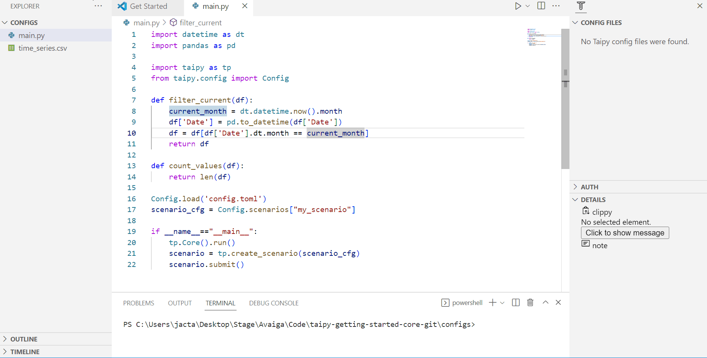

# Step 3: Different types of Data Nodes:

- *[Pickle](https://docs.taipy.io/en/latest/manuals/core/config/data-node-config/#pickle)* (default): Taipy can store and read any data that can be serializable.

- *[CSV](https://docs.taipy.io/en/latest/manuals/core/config/data-node-config/#csv)*: Taipy can read and store any data frame as a CSV.

- *[JSON](https://docs.taipy.io/en/latest/manuals/core/config/data-node-config/#json)*: Taipy can read and store any JSONable data as a JSON file.

- *[SQL](https://docs.taipy.io/en/latest/manuals/core/config/data-node-config/#sql)*: Taipy can read and store a table or database.

- *[Mongo](https://docs.taipy.io/en/develop/manuals/core/config/data-node-config/#mongo-collection)*: Taipy can read and store into a Mongo Collection

- *[Parquet]()*: Taipy can read and store data frames in a Parquet format

- *[Generic](https://docs.taipy.io/en/latest/manuals/core/config/data-node-config/#generic)*: Taipy provides a generic Data Node that can read and store any data based on a _reading_ and _writing_ function created by the user.

The execution graph used to explain the different concepts is quite simple.

1) Three Data Nodes:
    - _historical data_: initial CSV DataFrame. You can find the dataset used in the Getting Started [here](https://github.com/Avaiga/taipy-getting-started-core/blob/develop/src/time_series.csv).
    - _month_data_: a DataFrame after the filtering on the month (a _Pandas.DataFrame_ as a Pickle file)
    - _nb_of_values_: number of values in this month (int as a Pickle file)

2) Two tasks linking these Data Nodes:
    - _filter_: filters on the months of the data frame
    - _count_values_: calculates the number of elements in this month

3) One pipeline in a scenario gathering these two tasks.

{ width=700 style="margin:auto;display:block;border: 4px solid rgb(210,210,210);border-radius:7px" }

```python
def filter_current(df):
    current_month = dt.datetime.now().month
    df['Date'] = pd.to_datetime(df['Date']) 
    df = df[df['Date'].dt.month == current_month]
    return df

def count_values(df):
    return len(df)
```


{ width=700 style="margin:auto;display:block;border: 4px solid rgb(210,210,210);border-radius:7px" }


{ width=700 style="margin:auto;display:block;border: 4px solid rgb(210,210,210);border-radius:7px" }


=== "Taipy Studio/TOML configuration"

    - Create the beginning of the Config with Data Nodes following the graph.
    - Change the details of*_historical_data* in the 'Details' section of Taipy Studio
            - name: historical_data
            - Details: default_path='xxxx/yyyy.csv', storage_type=csv
    - Add tasks: filter_current and count_values
    - Finish the Config by connecting tasks and Data Nodes and creating the pipeline and scenario


    ```python
    Config.load('config_03.toml')

    # my_scenario is the id of the scenario configured
    scenario_cfg = Config.scenarios['my_scenario']
    ```

=== "Python configuration"

    ```python
    # here is a CSV Data Node
    historical_data_cfg = Config.configure_csv_data_node(id="historical_data",
                                                         default_path="time_series.csv")
    month_values_cfg =  Config.configure_data_node(id="month_data")
    nb_of_values_cfg = Config.configure_data_node(id="nb_of_values")
    ```


    ```python
    task_filter_cfg = Config.configure_task(id="filter_current",
                                                     function=filter_current,
                                                     input=historical_data_cfg,
                                                     output=month_values_cfg)

    task_count_values_cfg = Config.configure_task(id="count_values",
                                                     function=count_values,
                                                     input=month_values_cfg,
                                                     output=nb_of_values_cfg)
    ```


    ```python
    pipeline_cfg = Config.configure_pipeline(id="my_pipeline",
                                             task_configs=[task_filter_cfg,
                                                           task_count_values_cfg])

    scenario_cfg = Config.configure_scenario(id="my_scenario",
                                             pipeline_configs=[pipeline_cfg])

    #scenario_cfg = Config.configure_scenario_from_tasks(id="my_scenario",
    #                                                    task_configs=[task_filter_cfg,
    #                                                                  task_count_values_cfg])
    ```


```python
tp.Core().run()

scenario_1 = tp.create_scenario(scenario_cfg, creation_date=dt.datetime(2022,10,7), name="Scenario 2022/10/7")
scenario_1.submit()

print("Nb of values of scenario 1:", scenario_1.nb_of_values.read())
```
Results:
```
    [2022-12-22 16:20:03,424][Taipy][INFO] job JOB_filter_current_257edf8d-3ca3-46f5-aec6-c8a413c86c43 is completed.
    [2022-12-22 16:20:03,510][Taipy][INFO] job JOB_count_values_90c9b3c7-91e7-49ef-9064-69963d60f52a is completed.
    
    Nb of values of scenario 1: 896
```
