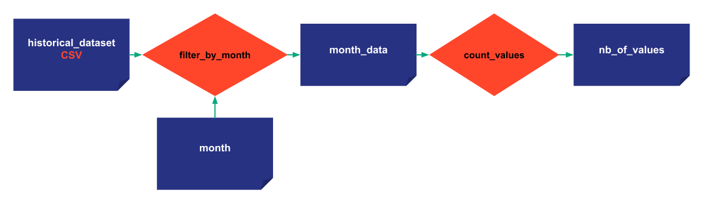

# Step 4: Cycles

Cycles have been introduced to reflect business situations that our customers encounter frequently. 

For instance, a large Fast Food chain wants to generate sales forecasts for its stores every week. When creating a given scenario, it will need to be attached to a given week. And often, amongst all the scenarios generated for a given week, a single one will be published. This kind of 'official' scenario will be referred to as 'Primary' scenario in Taipy  Core.

Note that Cycles can be completely ignored if the business problem doesn’t have any time frequency. 


In this step, scenarios are attached to a MONTHLY cycle. By Using Cycles the developer will benefit from specific Taipy's functions to navigate through these Cycles. For instance, Taipy can get all the scenarios created in a month by providing the Cycle. You can also get every primary scenario generated for the past X months  to easily monitor KPIs over time.

To get started, let’s slightly change the filter function by passing the month as an argument. You will need to create a new data node representing the month (see the steps below)


```python
def filter_by_month(df, month):
    df['Date'] = pd.to_datetime(df['Date']) 
    df = df[df['Date'].dt.month == month]
    return df
```

Then to introduce Cycles, you simply need to set the frequency (predefined attribute) of the scenario to Monthly (as described below).

{ width=700 style="margin:auto;display:block;border: 4px solid rgb(210,210,210);border-radius:7px" }


!!! example "Configuration"


    === "Taipy Studio"

        { width=700 style="margin:auto;display:block;border: 4px solid rgb(210,210,210);border-radius:7px" }

        - Recreate the config of the previous step but change the task accordingly with a new input Data Node (_month_).
        - Add the frequency property for the scenario and put "MONTHLY:FREQUENCY" (DAYLY, WEEKLY, MONTHLY, YEARLY)
        - Load the new configuration in the code

    === "Python configuration"

        The configuration is the same as the last step except for the scenario and task configuration. A new parameter is added for the frequency.

        ```python
        from taipy.config import Scope

        month_cfg =  Config.configure_data_node(id="month")

        task_filter_cfg = Config.configure_task(id="filter_by_month",
                                                     function=filter_by_month,
                                                     input=[historical_data_cfg, month_cfg],
                                                     output=month_values_cfg)

        ...

        scenario_cfg = Config.configure_scenario(id="my_scenario",
                                                 pipeline_configs=[pipeline_cfg],
                                                 frequency=Frequency.MONTHLY)


        ```


As you can see, a Cycle is activated  once you have set the desired frequency on the scenario. In this code snippet, since we have specified `frequency=Frequency.MONTHLY`, the corresponding scenario will be automatically attached to the correct period (month) once it is created. The _creation_date_ here is artificially given to the scenarios.

```python
tp.Core().run()

scenario_1 = tp.create_scenario(scenario_cfg,
                                creation_date=dt.datetime(2022,10,7),
                                name="Scenario 2022/10/7")
scenario_2 = tp.create_scenario(scenario_cfg,
                                creation_date=dt.datetime(2022,10,5),
                                name="Scenario 2022/10/5")
```

Scenario 1 and Scenario 2 are two scenario entities/instances created from the same scenario configuration. They belong to the same Cycle, but they don't share the same Data Nodes. By default, each scenario instance has its own data node instances. They are not shared with any other scenario.  The Scope concept can modify this behavior and it will be covered in the next step.


```python
scenario_1.month.write(10)
scenario_2.month.write(10)


print("Month Data Node of Scenario 1", scenario_1.month.read())
print("Month Data Node of Scenario 2", scenario_2.month.read())

scenario_1.submit()
scenario_2.submit()
```


Results:
```
    Month Data Node of Scenario 1 10
    Month Data Node of Scenario 2 10
    [2022-12-22 16:20:04,746][Taipy][INFO] job JOB_filter_by_month_a4d3c4a7-5ec9-4cca-8a1b-578c910e255a is completed.
    [2022-12-22 16:20:04,833][Taipy][INFO] job JOB_count_values_a81b2f60-e9f9-4848-aa58-272810a0b755 is completed.
    [2022-12-22 16:20:05,026][Taipy][INFO] job JOB_filter_by_month_22a3298b-ac8d-4b55-b51f-5fab0971cc9e is completed.
    [2022-12-22 16:20:05,084][Taipy][INFO] job JOB_count_values_a52b910a-4024-443e-8ea2-f3cdda6c1c9d is completed.
    [2022-12-22 16:20:05,317][Taipy][INFO] job JOB_filter_by_month_8643e5cf-e863-434f-a1ba-18222d6faab8 is completed.
    [2022-12-22 16:20:05,376][Taipy][INFO] job JOB_count_values_72ab71be-f923-4898-a8a8-95ec351c24d9 is completed.
```

## Primary scenarios

In each Cycle, there is a primary scenario. Having a primary scenario is interesting because it represents the important scenario of the Cycle, the reference. By default, the first scenario created for a cycle will be primary.

`tp.set_primary(<Scenario>)` allows changing the primary scenario in a Cycle.

`<Scenario>.is_primary` identifying if a boolean whether the scenario is primary or not.

```python
print("Scenario 1 before", scenario_1.is_primary)
print("Scenario 2 before", scenario_2.is_primary)

tp.set_primary(scenario_2)

print("Scenario 1 after", scenario_1.is_primary)
print("Scenario 2 after", scenario_2.is_primary)
```
Results:

```
    Scenario 1 before True
    Scenario 2 before False
    Scenario 1 after False
    Scenario 2 after True
```

Scenario 3 is the only scenario in another Cycle due to its creation date and is therefore the default primary scenario.

```python
scenario_3 = tp.create_scenario(scenario_cfg,
                                creation_date=dt.datetime(2021,9,1),
                                name="Scenario 2022/9/1")
scenario_3.month.write(9)
scenario_3.submit()

print("Is scenario 3 primary?", scenario_3.is_primary)
```

Results:

```
    [2022-12-22 16:20:05,317][Taipy][INFO] job JOB_filter_by_month_8643e5cf-e863-434f-a1ba-18222d6faab8 is completed.
    [2022-12-22 16:20:05,376][Taipy][INFO] job JOB_count_values_72ab71be-f923-4898-a8a8-95ec351c24d9 is completed.

    Is scenario 3 primary? True
```

Also, as you can see, every scenario has been submitted and executed entirely. However, the results for these tasks are all the same. Skipping Tasks (defined in subsequent steps) will help optimize your executions by skipping the execution of redundant tasks.

## Useful functions on cycles

- `tp.get_primary_scenarios()`: returns a list of all primary scenarios

- `tp.get_scenarios(cycle=<Cycle>)`: returns all the scenarios in the Cycle

- `tp.get_cycles()`: returns the list of Cycles

- `tp.get_primary(<Cycle>)`: returns the primary scenario of the Cycle
