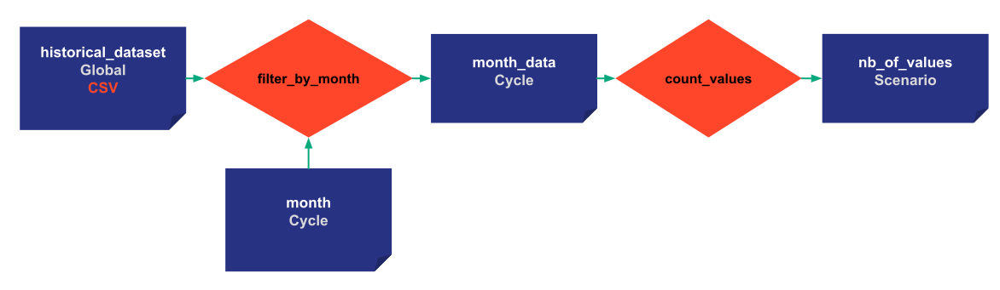

# Step 5: Scoping 

Scoping determines how Data Nodes are shared between cycles, scenarios, and pipelines. Indeed, multiple scenarios can have their own Data Nodes or share the same one. For example, the initial/historical dataset is usually shared by all the scenarios/pipelines/cycles. It has a Global Scope and will be unique in the entire application.

- **Pipeline** scope: two pipelines can reference different Data Nodes even if their names are the same. For example, we can have a _prediction_ Data Node of an ARIMA model (ARIMA pipeline) and a _prediction_ Data Node of a RandomForest model (RandomForest pipeline). A scenario can contain multiple pipelines.

- **Scenario** scope: pipelines share the same Data Node within a scenario. 

- **Cycle** scope: scenarios from the same Cycle share the same Data Node.

- **Global** scope: unique Data Node for all the scenarios/pipelines/cycles.

{ width=700 style="margin:auto;display:block;border: 4px solid rgb(210,210,210);border-radius:7px" }

{ width=700 style="margin:auto;display:block;border: 4px solid rgb(210,210,210);border-radius:7px" }


=== "Taipy Studio/TOML configuration"

    Only the configuration of Data Nodes will change by adding a Scope. The configuration is taken in the previous step, so you can directly copy the last TOML Config file.
    
    - Change the Scope of historical_data to be global
            - name: historical_data
            - Details: default_path=xxxx/yyyy.csv, storage_type=csv, scope=GLOBAL:SCOPE
    - Change the Scope of month_data and month to be Cycle
            - name: output
            - Details: storage_type:pickle, scope=CYCLE:SCOPE
    - Load the new configuration in the code
    
=== "Python configuration"

    Only the configuration of Data Nodes will change by adding a Scope. The configuration is taken in the previous step so you can copy the previous code directly.

    ```python
    historical_data_cfg = Config.configure_csv_data_node(id="historical_data",
                                                     default_path="time_series.csv",
                                                     scope=Scope.GLOBAL)
    month_cfg =  Config.configure_data_node(id="month", scope=Scope.CYCLE)

    month_values_cfg = Config.configure_data_node(id="month_data",
                                                   scope=Scope.CYCLE)
    ```


Cycles are created depending on the _creation_date_ of scenarios. In the example below, _creation_data_ are defined but their value is normally the date of when the scenario was created.

```python
tp.Core().run()

scenario_1 = tp.create_scenario(scenario_cfg,
                                creation_date=dt.datetime(2022,10,7),
                                name="Scenario 2022/10/7")
scenario_2 = tp.create_scenario(scenario_cfg,
                               creation_date=dt.datetime(2022,10,5),
                               name="Scenario 2022/10/5")
scenario_3 = tp.create_scenario(scenario_cfg,
                                creation_date=dt.datetime(2021,9,1),
                                name="Scenario 2021/9/1")
```

Scenario 1 and 2 belongs to the same Cycle, so we can define the month just once for scenario 1 and 2 because _month_ has a Cycle scope.

{ width=700 style="margin:auto;display:block;border: 4px solid rgb(210,210,210);border-radius:7px" }


```python
scenario_1.month.write(10)
scenario_3.month.write(9)
print("Scenario 1: month", scenario_1.month.read())
print("Scenario 2: month", scenario_2.month.read())
print("Scenario 3: month", scenario_2.month.read())
```
Results:
```
    Scenario 1: month 10
    Scenario 2: month 10
    Scenario 3: month 9
```

Defining the month of scenario 1 will also determine the month of scenario 2 because they share the same Data Node. However, because `nb_of_values` is of Scenario Scope,  each `nb_of_values` has its own value for each scenario. This value can also be identical.
