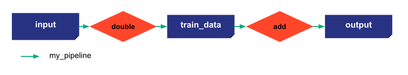

# Execution modes

Taipy has different ways to execute the code. There are two different job execution modes:
- _standalone_ mode: asynchronous. Jobs can be run in parallel depending on the graph of execution if _max_nb_of_workers_ > 1
- _development_ mode: synchronous

```python
# Normal function used by Taipy
def double(nb):
    return nb * 2

def add(nb):
    print("Wait 10 seconds in add function")
    time.sleep(10)
    return nb + 10
```

{ width=700 style="margin:auto;display:block;border: 4px solid rgb(210,210,210);border-radius:7px" }


This line of code will change the execution mode (the default execution mode is _development_). Changing it to _standalone_ will make Taipy Core asynchronous. Here a maximum of two tasks will be able to run simultaneously.

```python
Config.configure_job_executions(mode="standalone", max_nb_of_workers=2)
```


```python
if __name__=="__main__":
    tp.Core().run()
    scenario_1 = tp.create_scenario(scenario_cfg)
    scenario_1.submit()
    scenario_1.submit()

    time.sleep(30)
```

Options of _submit_:
- _wait_: if _wait_ is True, the submit is synchronous and will wait for the end of all the jobs (if _timeout_ is not defined)
- _timeout_: if _wait_ is True, Taipy will wait for the end of the submission until a certain amount of time

```python
if __name__=="__main__":
    tp.Core().run()
    scenario_1 = tp.create_scenario(scenario_cfg)
    scenario_1.submit(wait=True)
    scenario_1.submit(wait=True, timeout=5)
```
