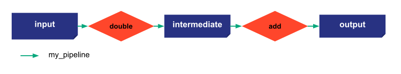

# Callback on scenarios

This step reuses the configuration provided in the step 7 except for the scenario configuration.

{ width=700 style="margin:auto;display:block;border: 4px solid rgb(210,210,210);border-radius:7px" }

To have an action after the change of a job status, we can subscribe a function to a scenario. This function will be called each time a job has its status changed. I can be used to create logs or create an event for Taipy GUI.
```python
def callback_scenario(scenario, job):
    """All the scenarios are subscribed to the callback_scenario_state function. It means whenever a job is done, it is called.

    Args:
        scenario (Scenario): the scenario of the job changed
        job (_type_): the job that has its status changed
    """
    print(scenario.name)
    if job.status.value == 7:
        for data_node in job.task.output.values():
            print(data_node.read())

```
